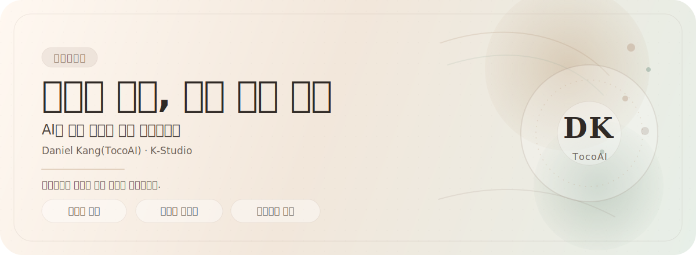

  

  <a href="https://github.com/K-Daniel-bot">깃허브</a> ·
  <a href="https://github.com/K-Daniel-bot?tab=repositories">저장소</a> ·
  <a href="https://blog.naver.com/ejdnjs0930">블로그</a>

  조용한 화면에 오래 남는 온도를 담고 있습니다.

## 소개

안녕하세요. Daniel Kang(TocoAI)입니다.

K-Studio에서 AI와 제품 경험이 자연스럽게 이어지는 화면을 만들고 있습니다.

화려함보다 여운이 남는 화면을 좋아하고, 읽히는 구조와 부드러운 움직임을 끝까지 다듬는 편입니다.

- 하는 일: AI 에이전트, 프론트엔드 시스템, 자동화
- 좋아하는 방식: 단정한 구조, 섬세한 움직임, 분명한 메시지
- 지금: 연구 중심 워크플로와 오픈소스 도구를 다듬는 중

## 선별한 작업

지금의 방향을 가장 잘 보여주는 오픈소스 프로젝트와 실험들입니다.

<table>
  <tr>
    <td width="50%" valign="top">
      <h3>01. everything-claude-code</h3>
      
Claude Code와 그 너머의 에이전트 작업 흐름을 다듬고 정리하는 시스템입니다.

      
<strong>기술</strong>: JavaScript

      
<a href="https://github.com/K-Daniel-bot/everything-claude-code">코드</a>

    </td>
    <td width="50%" valign="top">
      <h3>02. openscreen</h3>
      
무료로 가볍고 선명한 데모를 만들 수 있는 오픈소스 도구입니다.

      
<strong>기술</strong>: TypeScript

      
<a href="https://github.com/K-Daniel-bot/openscreen">코드</a>

    </td>
  </tr>
  <tr>
    <td width="50%" valign="top">
      <h3>03. Kakao-CLI</h3>
      
에이전트가 카카오톡 메시지를 주고받을 수 있도록 연결한 CLI 도구입니다.

      
<strong>기술</strong>: Swift

      
<a href="https://github.com/K-Daniel-bot/Kakao-CLI">코드</a>

    </td>
    <td width="50%" valign="top">
      <h3>04. autoresearch</h3>
      
작은 자원에서도 연구 흐름이 끊기지 않도록 돕는 자동화 실험입니다.

      
<strong>기술</strong>: Python

      
<a href="https://github.com/K-Daniel-bot/autoresearch">코드</a>

    </td>
  </tr>
</table>

## 지금

- K-Studio 작업
- 연구 중심 에이전트 워크플로
- 오픈소스 도구와 정제된 인터페이스

## 기술

`JavaScript` · `TypeScript` · `Python` · `Swift` · `React` · `Next.js` · `Tailwind CSS` · `SVG`

## 연락

- 깃허브: [K-Daniel-bot](https://github.com/K-Daniel-bot)
- 블로그: [blog.naver.com/ejdnjs0930](https://blog.naver.com/ejdnjs0930)

  조용하지만 오래 남는 작업을 계속 만들고 있습니다.

  

<!-- 선택 사항: 통계 뱃지

  

-->
